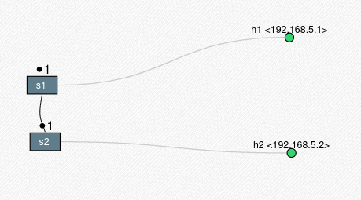
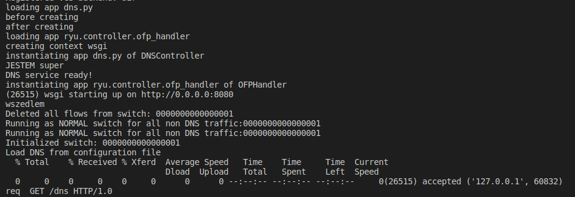
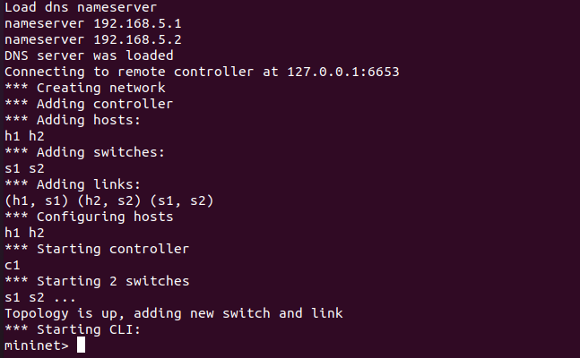
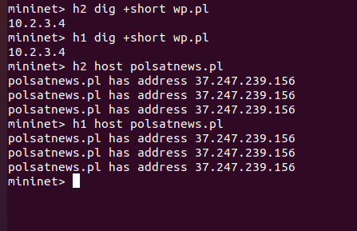

# dns_resolver_ryu
#ryu #python3 #dns

## About Project
The assumption of the project was to construct an application that, using the OpenFlow protocol, will enable decryption of dns addresses.
The project was made using mininet and ryu-manager. Ryu-manager is an implementation of the OpenFlow protocol in Python.
### How Looks our Network

### Example of work
Our dns request from host in mininet


In this case we have only a few website awaliable like below:


This result about which page are avaliable get when send below request:
```console
curl localhost:8080/dns
```
Where localhost it is a address where was hosted our controller.

#### Configure Enviroment 
Now we can must prepare our enviroment to run the procets we need:
+ Mininet
+ python2 and python3 version (You can check which version you have using whereis python) Urgent! Not all library is supported by python3.

```console
sudo apt-get install mininet
python -m pip install --user virtualenv 
python -m venv sdn
source sdn/bin/activate
pip install -r requirements.cfg
```
if we want to use the terminal of a given station, you must install Xterm

```console
sudo apt-get install -y xterm
```

#### How run application
For the convenience of use, we will use 3 consoles
+ Cosole where will be runing ryu-manager
+ Console where will be running mininet
+ Console where we will be make operation about dns

For fisrt and secound coinsole we must have activate our enviromnet.

Console 1(RYU)
```console
ryu-manager dns.py
```


Console 2(MININET)
```console
sudo python2 net.py --controler=remote,ip=127.0.0.1,port=6653
```


Console 3
'''console
curl localhost:8080/dns
'''


#### Create DNS Query
List DNS list
```console 
curl localhost:8080/dns
```

Add to DNS
```console 
curl localhost:8080/dns    -H "Content-Type: application/json"     -d '{"name":"s2.com","ip":"10.128.1.7"}'
curl localhost:8080/dns    -H "Content-Type: application/json"     -d '{"name":"s1.com","ip":"10.128.1.6"}'
```
UPDATE to DNS
```console 
curl localhost:8080/dns    -X PUT -H "Content-Type: application/json"     -d '{"name":"s1.com","ip":"10.128.1.4"}'
```

DELETE from DNS
```console 
curl localhost:8080/dns    -X PUT -H "Content-Type: application/json"     -d '{"name":"s1.com","ip":"10.128.1.4"}'
curl localhost:8080/dns    -X PUT -H "Content-Type: application/json"     -d '{"name":"wp.pl"}'
curl localhost:8080/dns    -X PUT -H "Content-Type: application/json"     -d '{"ip":"37.247.239.156"}'
```


#### Example of send query to dns from host (reachability test)
For Example

Console 2(mininet)
```console
h2 dig +short wp.pl
h1 dig +short wp.pl

h2 host polsatnews.pl
h1 host polsatnews.pl

```

